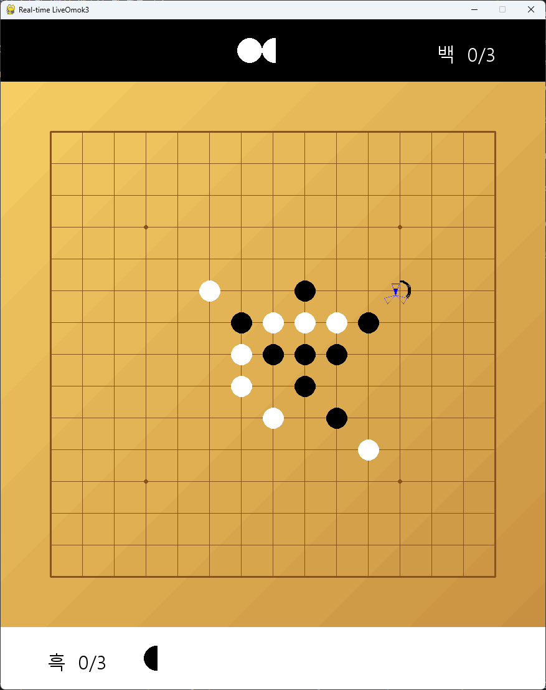

# LiveOmok
A real-time based (not turn-based) Omok game.



> Note: Omok is a Korean pronunciation of the game "Gomoku (五目)", which is also known as "Wuziqi", "Gobang" or "Five in a Row".


# How to play
연습 모드 및 온라인 모드를 지원합니다.
연습 모드의 경우 **좌클릭은 흑돌, 우클릭은 백돌**을 둡니다.
- **돌 게이지**는 3초에 하나씩 채워짐. 최대치는 3개이지만, 새치기를 당해 돌 게이지를 돌려받는 경우 최대 6개까지 보유할 수 있음.
- *빈 칸을 클릭* 시 돌 게이지를 1칸 소모하여 돌을 **예약**할 수 있음. 예약한 돌은 1.5초 후 해당 자리에 **배치**됨.
- 상대방 돌이 예약되어 배치되기를 기다리는 경우, *예약한 상대 돌을 클릭*하면 돌 게이지를 2칸 소모하여 **새치기**를 할 수 있음.
  - 새치기를 한 경우 예약되지 않고 그 자리에 바로 배치됨
  - 새치기를 당한 경우 돌 게이지를 1칸 돌려받음
- 굉장히 중요한 위치여서 상대의 새치기를 막아야 할 필요가 있는 경우, *예약한 자기 돌을 클릭*하면 돌 게이지를 0.5칸 더 소모하여 **확정**해 즉시 배치할 수 있음.
  - 온라인 플레이의 경우 *빈 칸을 우클릭*하면 예약을 생략하고 즉시 확정할 수 있음
- 내가 예약할 자리를 예약이 끝나기 전 상대가 새치기할 수 있는 경우 커서 옆에 빨간색 느낌표가 뜸
  - 상대가 예약한 자리를 예약이 끝나기 전 내가 새치기할 수 있는 경우 해당 칸에 초록색 느낌표가 뜸
- 오목을 3개 먼저 완성할 경우 승리 (6목을 만들 경우 오목 2개, 7목을 만들 경우 오목 3개로 간주)


# TODO
- 무승부
- 선입력
- 인공지능 (아직은 계획만 존재. 어떤 방식/모델이 좋을까?)
- 로컬에서 1:1 플레이 시 마우스가 아닌 키보드로 대결
- 마우스로 1:1 하는 건 연습 모드에서
- 효과음 (돌 둘 때, 승/패 시 등)
- 인트로 화면 (로컬 대결, 원격 대결 등 선택 가능) 및 리플레이 기능
- 채팅 기능 (헤더는 만들어 놨지만 채팅 기능을 따로 구현하진 않음)
- 화면 크기를 줄이고 가로로 길게 만들기 (모바일에선 세로가 더 나을 듯)


# Installation
Tested on Windows 11, python 3.10-3.12

Other OSes may work, but I haven't tested them.

## Conda
```
conda env create -n liveomok python=3.12
pip install pygame pillow numpy
```

## Pipenv
```
pipenv install
```


# Running the game

## Conda
```
conda activate liveomok
python main.py
```

## Pipenv
```
pipenv run python main.py
```
